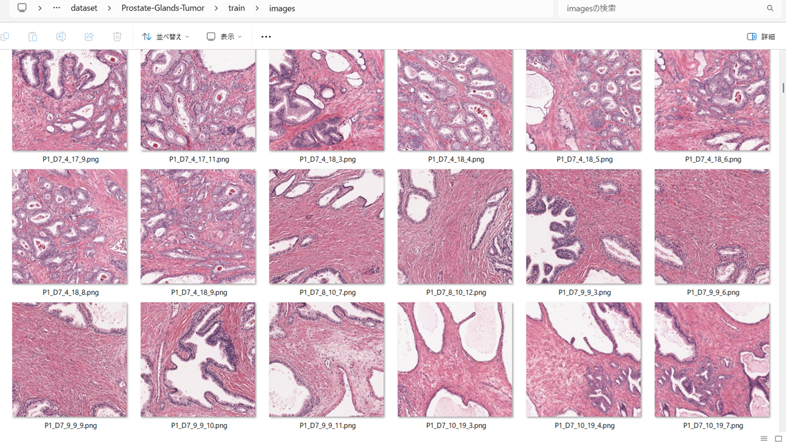
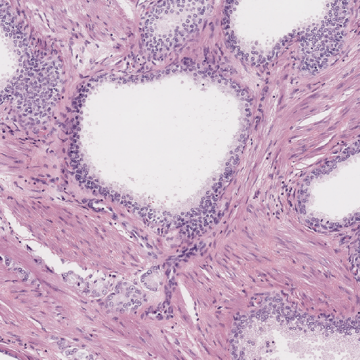

<h2>TensorFlow-FlexUNet-Image-Segmentation-RINGS-Prostate-Glands-Tumor (2025/07/20)</h2>
This is the first experiment of Image Segmentation for Prostate-Glands-Tumor
 based on 
our <a href="./src/TensorFlowFlexUNet.py">TensorFlowFlexUNet</a>
 (<b>TensorFlow Flexible UNet Image Segmentation Model for Multiclass</b>) and a 512x512 pixels 
  <a href="https://drive.google.com/file/d/10tgRUWXHYubjv7ZU0g4pwixq1XldfMkr/view?usp=sharing">
RINGS-Prostate-Glands-Tumor-ImageMask-Dataset-V2.zip</a>, which was derived by us from the 
<a href="https://data.mendeley.com/datasets/h8bdwrtnr5/1">
<b>
RINGS algorithm dataset 
</b>
</a>
  

<b>Actual Image Segmentation for 512x512 Prostate-Glands-Tumor images</b> 
As shown below, the inferred masks look similar to the ground truth masks.
The green region represents a prostate gland, and the red a tumor respectively.
   
<table>
<tr>
<th>Input: image</th>
<th>Mask (ground_truth)</th>
<th>Prediction: inferred_mask</th>
</tr>
<tr>
<td></td>
<td></td>
<td></td>
</tr>
<tr>
<td></td>
<td></td>
<td></td>
</tr>
<tr>
<td></td>
<td></td>
<td></td>
</tr>
</table>

 
<h3>1. Dataset Citation</h3>
The dataset used here has been take from the following web site 

<a href="https://data.mendeley.com/datasets/h8bdwrtnr5/1">
<b>
RINGS algorithm dataset 
</b>
</a>

 
Published: 15 April 2021 
Version 1 
DOI:10.17632/h8bdwrtnr5.1 
 
<b>Contributors:</b> 
Massimo Salvi, Martino Bosco, Luca Molinaro, Alessandro Gambella, Mauro Giulio Papotti, 
 Udyavara Rajendra Acharya, Filippo Molinari 
 
<b>Description</b> 

This repository contains the image dataset and the manual annotations used to develop the RINGS algorithm for automated prostate glands segmentation: 
 Salvi M., Bosco M., L. Molinaro, Gambella A., Papotti M., Udyavara Rajendra Acharya, and Molinari F.,  
"A hybrid deep learning approach for gland segmentation in prostate histopathological images",  
Artificial Intelligence in Medicine 2021 (DOI: 10.1016/j.artmed.2021.102076)
 
 
Background: In digital pathology, the morphology and architecture of prostate glands have been routinely adopted by pathologists to evaluate the presence of cancer tissue. The manual annotations are operator-dependent, error-prone and time-consuming. The automated segmentation of prostate glands can be very challenging too due to large appearance variation and serious degeneration of these histological structures.
Method: A new image segmentation method, called RINGS (Rapid IdentificatioN of Glandural Structures), is presented to segment prostate glands in histopathological images. We designed a novel glands segmentation strategy using a multi-channel algorithm that exploits and fuses both traditional and deep learning techniques. Specifically, the proposed approach employs a hybrid segmentation strategy based on stroma detection to accurately detect and delineate the prostate glands contours.
Results: Automated results are compared with manual annotations and seven state-of-the-art techniques designed for glands segmentation. Being based on stroma segmentation, no performance degradation is observed when segmenting healthy or pathological structures.  Our method is able to delineate the prostate gland of the unknown histopathological image with a dice score of 90.16% and outperforms all the compared state-of-the-art methods.
Conclusions: To the best of our knowledge, the RINGS algorithm is the first fully automated method capable of maintaining a high sensitivity even in the presence of severe glandular degeneration. The proposed method will help to detect the prostate glands accurately and assist the pathologists to make accurate diagnosis and treatment. The developed model can be used to support prostate cancer diagnosis in polyclinics and community care centres. 
  
<b>Licence</b>: CC BY 4.0 
 
 
<h3>
<a id="2">
2 Prostate-Glands-Tumor ImageMask Dataset
</a>
</h3>
 If you would like to train this Prostate-Glands-Tumor Segmentation model by yourself,
 please download the dataset from the google drive  
<a href="https://drive.google.com/file/d/10tgRUWXHYubjv7ZU0g4pwixq1XldfMkr/view?usp=sharing">
RINGS-Prostate-Glands-Tumor-ImageMask-Dataset-V2.zip</a>.
 
, expand the downloaded ImageMaskDataset and put it under <b>./dataset</b> folder to be
<pre>
./dataset
└─Prostate-Glands-Tumor
    ├─test
    │   ├─images
    │   └─masks
    ├─train
    │   ├─images
    │   └─masks
    └─valid
        ├─images
        └─masks
</pre>
On the derivation of this dataset, please refer to the following Python scripts. 
<li>
<a href="./generator/GlandsTumorImageMaskDatasetGenerator.py">GlandsTumorImageMaskDatasetGenerator.py</a>
</li>
<li>
<a href="./generator/split_master.py">split_master.py</a>
</li>
 
 
<b>Prostate-Glands-Tumor Statistics</b> 
 
 
As shown above, the number of images of train and valid datasets is not large to use for a training set of our segmentation model.
 
 
<b>Train_images_sample</b> 

 
<b>Train_masks_sample</b> 

 
<h3>
3 Train TensorFlowFlexUNet Model
</h3>
 We trained Prostate-Glands-Tumor TensorFlowFlexUNet Model by using the following
<a href="./projects/TensorFlowFlexUNet/Prostate-Glands-Tumor/train_eval_infer.config"> <b>train_eval_infer.config</b></a> file.  
Please move to ./projects/TensorFlowFlexUNet/Prostate-Glands-Tumor and run the following bat file. 
<pre>
>1.train.bat
</pre>
, which simply runs the following command. 
<pre>
>python ../../../src/TensorFlowFlexUNetTrainer.py ./train_eval_infer.config
</pre>

<b>Model parameters</b> 
Defined a small <b>base_filters = 16 </b> and large <b>base_kernels = (11,11)</b> for the first Conv Layer of Encoder Block of 
<a href="./src/TensorFlowFlexUNet.py">TensorFlowFlexUNet.py</a> 
and a large num_layers (including a bridge between Encoder and Decoder Blocks).
<pre>
[model]
;You may specify your own UNet class derived from our TensorFlowFlexModel
model         = "TensorFlowFlexUNet"
generator     =  False
image_width    = 512
image_height   = 512
image_channels = 3
num_classes    = 3

base_filters   = 16
base_kernels   = (11,11)
num_layers     = 8
dropout_rate   = 0.04
dilation       = (1,1)
</pre>
<b>Learning rate</b> 
Defined a small learning rate.  
<pre>
[model]
learning_rate  = 0.00008
</pre>
<b>Loss and metrics functions</b> 
Specified "categorical_crossentropy" and <a href="./src/dice_coef_multiclass.py">"dice_coef_multiclass"</a>. 
<pre>
[model]
loss           = "categorical_crossentropy"
metrics        = ["dice_coef_multiclass"]
</pre>
<b>Dataset class</b> 
Specifed <a href="./src/ImageCategorizedMaskDataset.py">ImageCategorizedMaskDataset</a> class. 
<pre>
[dataset]
class_name    = "ImageCategorizedMaskDataset"
</pre>
 
<b>Learning rate reducer callback</b> 
Enabled learing_rate_reducer callback, and a small reducer_patience.
<pre> 
[train]
learning_rate_reducer = True
reducer_factor     = 0.5
reducer_patience   = 4
</pre>
<b>Early stopping callback</b> 
Enabled early stopping callback with patience parameter.
<pre>
[train]
patience      = 10
</pre>

<b>RGB Color map</b> 
rgb color map dict for Prostate-Glands-Tumor 3 classes. 
<pre>
[mask]
mask_file_format = ".png"
;rgb color map dict for 1+2 classes
;background:black,  glands:green, tumor: red
rgb_map = {(0,0,0):0, (0,255, 0):1, (255,0,0):2,}
</pre>

<b>Epoch change inference callback</b> 
Enabled <a href="./src/EpochChangeInferencer.py">epoch_change_infer callback</a></b>. 
<pre>
[train]
epoch_change_infer       = True
epoch_change_infer_dir   =  "./epoch_change_infer"
num_infer_images         = 6
</pre>

By using this callback, on every epoch_change, the inference procedure can be called
 for 6 images in <b>mini_test</b> folder. This will help you confirm how the predicted mask changes 
 at each epoch during your training process.    

<b>Epoch_change_inference output at starting (epoch 1,2,3)</b> 
 
 
<b>Epoch_change_inference output at middlepoint (epoch 23,24,25)</b> 
 
 
<b>Epoch_change_inference output at ending (epoch 47,48,49)</b> 
 
 
In this experiment, the training process was stopped at epoch 49 by EarlyStopping callback.  
 
 

<a href="./projects/TensorFlowFlexUNet/Prostate-Glands-Tumor/eval/train_metrics.csv">train_metrics.csv</a> 
 

 
<a href="./projects/TensorFlowFlexUNet/Prostate-Glands-Tumor/eval/train_losses.csv">train_losses.csv</a> 
 

 

<h3>
4 Evaluation
</h3>
Please move to <b>./projects/TensorFlowFlexUNet/Prostate-Glands-Tumor</b> folder, 
and run the following bat file to evaluate TensorFlowUNet model for BUSBRA. 
<pre>
./2.evaluate.bat
</pre>
This bat file simply runs the following command.
<pre>
python ../../../src/TensorFlowFlexUNetEvaluator.py ./train_eval_infer_aug.config
</pre>

Evaluation console output: 

  Prostate-Glands-Tumor

<a href="./projects/TensorFlowFlexUNet/Prostate-Glands-Tumor/evaluation.csv">evaluation.csv</a> 
The loss (categorical_crossentropy) to this Prostate-Glands-Tumor/test was not low and dice_coef_multiclass 
not high as shown below.
 
<pre>
categorical_crossentropy,0.524
dice_coef_multiclass,0.7551
</pre>
 

<h3>
5 Inference
</h3>
Please move <b>./projects/TensorFlowFlexUNet/Prostate-Glands-Tumor</b> folder 
,and run the following bat file to infer segmentation regions for images by the Trained-TensorFlowUNet model for BUSBRA. 
<pre>
./3.infer.bat
</pre>
This simply runs the following command.
<pre>
python ../../../src/TensorFlowFlexUNetInferencer.py ./train_eval_infer_aug.config
</pre>

<b>mini_test_images</b> 
 
<b>mini_test_mask(ground_truth)</b> 
 

<b>Inferred test masks</b> 
 
 

<b>Enlarged images and masks of 512x512 pixels</b> 

<table>
<tr>
<th>Image</th>
<th>Mask (ground_truth)</th>
<th>Inferred-mask</th>
</tr>

<tr>
<td></td>
<td></td>
<td></td>
</tr>

<tr>
<td></td>
<td></td>
<td></td>
</tr>

<tr>
<td></td>
<td></td>
<td></td>
</tr>

<tr>
<td></td>
<td></td>
<td></td>
</tr>

<tr>
<td></td>
<td></td>
<td></td>
</tr>

<tr>
<td></td>
<td></td>
<td></td>
</tr>

</table>

 

<h3>
References
</h3>
<b>1. Prostate-Glands-Tumor: A Breast Ultrasound Dataset for Assessing Computer-aided Diagnosis Systems</b> 
<b>RINGS algorithm dataset</b> 
Massimo Salvi, Martino Bosco, Luca Molinaro, Alessandro Gambella, Mauro Giulio Papotti, 
 Udyavara Rajendra Acharya, Filippo Molinari 
DOI:10.17632/h8bdwrtnr5.1 
<a href="https://data.mendeley.com/datasets/h8bdwrtnr5/1">
https://data.mendeley.com/datasets/h8bdwrtnr5/1</a>
 

 
<b>2.Tensorflow-Image-Segmentation-RINGS-Prostate-Tumor</b> 
Toshiyuki Arai @antillia.com 
<a href="https://github.com/sarah-antillia/Tensorflow-Image-Segmentation-RINGS-Prostate-Tumor">
https://github.com/sarah-antillia/Tensorflow-Image-Segmentation-RINGS-Prostate-Tumor
</a>
 
 
<b>3.Tensorflow-Image-Segmentation-RINGS-Prostate-Glands</b> 
Toshiyuki Arai @antillia.com 
<a href="https://github.com/sarah-antillia/Tensorflow-Image-Segmentation-RINGS-Prostate-Glands">
https://github.com/sarah-antillia/Tensorflow-Image-Segmentation-RINGS-Prostate-Glands
</a>
 
 
<b>4.Tensorflow-Image-Segmentation-Pre-Augmented-RINGS-Prostate-Tumor</b> 
<a href="Tensorflow-Image-Segmentation-Pre-Augmented-RINGS-Prostate-Tumor">
Tensorflow-Image-Segmentation-Pre-Augmented-RINGS-Prostate-Tumor</a>
 
 

